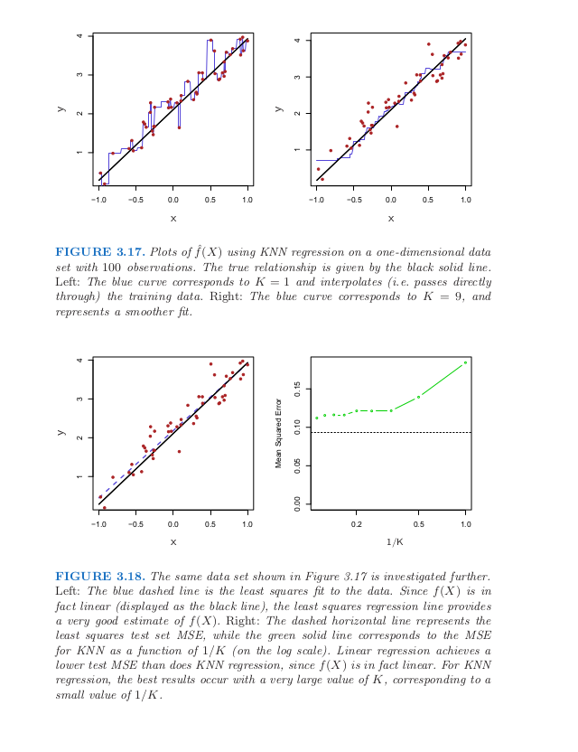
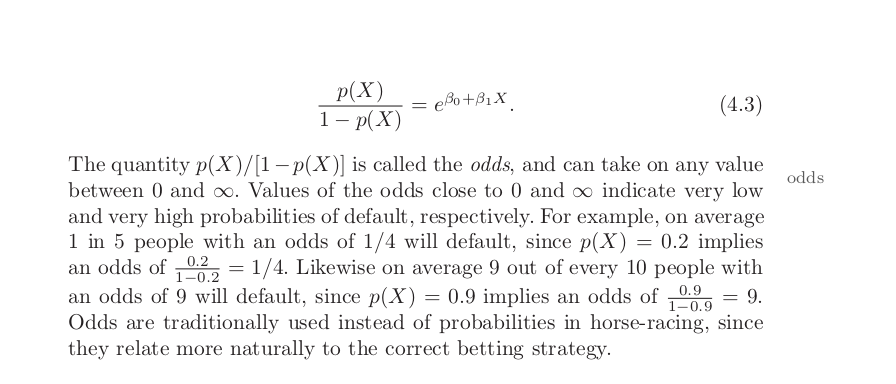
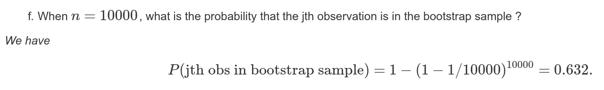
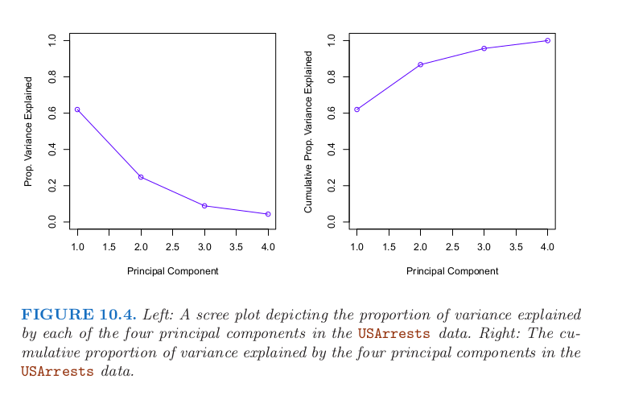

https://rpubs.com/JDAHAN/172473
## Machine Learning Summary

For each algorithm
- Definition
- Parameter
- Assumption

### Part 1: Traditional Machine Learning
1. Linear regression

__Definition:__ linear relation between Y and X

- Correlation: strength of relation between two variables
- R-square: measures the proportion of variability in Y that can be explained using X. __in other words, how much variance of output / observed value / Y is because of inputs / X__
- Adjusted R-squared: a new version R-squared in multiple regression (add penalty if adding more inputs does not help)
- R-square does not tell you whether the model is good or not, it is just tell you relationship between movements of 2 variables.
- Collinearity: two or more X are closed related to one another, adding both of them does not lead to improvement -> scatter plot to check it
- In multiple variable, we need to decide which variables are important. We can do this by examine p-value associate with each X's t-statistic. P-low -> we can accept alternative hypothesis, the variable is important
- K-NN regressor: get average of K points, if choose K wisely, can approximate linear

2. Logistic regression

- What coefficient in logistic function means: an increase of X by one unit changes the log odd by Beta (coefficient)
- ROC curve (only for binary classification): display two types of error of all possible threshold, True Positive Rate and False Positive Rate.

3. Decision Trees

- Classification Tree: based on __Gini Index or Cross-entropy__ to decide which nodes to split and when we need to stop.
- Regression Trees: based on __RSS__ to decide

Decision tree has high variance and high bias. It means if we split data by half and fit two decision trees on each half. Two trees are very different.

Linear regression has low variance. It would produce same results.

4. Bagging and boosting (Random Forest, Ada-boost)

- Bagging - Bagging Tree - Random Forest: averaging high-variance model (Decision Tree) -> reduce variance

__Out-of-bag error:__

source: https://rpubs.com/ppaquay/65561

1/3 observations are not used in bagging samples so we can use these samples for cross-validation and the result of predictions on those sample are called __Out-of-bag error__. It can
be shown that with number of observation sufficiently large, OOB error is __virtually equivalent
to leave-one-out cross-validation error__. The OOB approach for estimating
the test error is particularly convenient when performing bagging on large
data sets for which cross-validation would be computationally onerous.

- __Random Forest__ is an improvement of bagged trees by way of a small tweak that de-correlates trees. For bagged trees which use all features, the trees tend to use dominant features and every tree is highly correlated and averaging trees cannot reduce error. While Random Forest uses only a proportion of features (m = sqrt(p)), this way we can de-correlate trees.

- Boosting - Adaboost:

5. How to avoid overfitting

Cross-validation: separate data into training set, validated set and test set. Validated set will be used to tuned model and estimate the error of test set. However using this strategy will tend to overestimate the error of test set. k-fold cross validation gives us better strategy to estimate the test error.

6. Clustering / Unsupervised Learning

__Principle Component Analysis:__ When faced with a large set of correlated variables, principal components allow us to summarize this set with a smaller number of representative variables that collectively explain most of the variability in the original set. PCA represents data in such a way that can preserve data variability. How to choose number of dimension in PCA

Plot number of PC versus Cumulative proportion of variance explained, usually we pick the point 95% of data explained, for example in the figure 10.4, we may pick PC = 3

__K-means:__ cluster data into K group based on distance (Euclidean) from K centroids to data points within cluster

### Part 2: Deep learning

__Examples__

1. Cumulative sum of top 10 most profitable products of the last 6 month for customers in Seattle.
2. Assumptions about logistic and linear regression
3. Explain colinearity
4. Step by Step of a machine learning algorithms  
