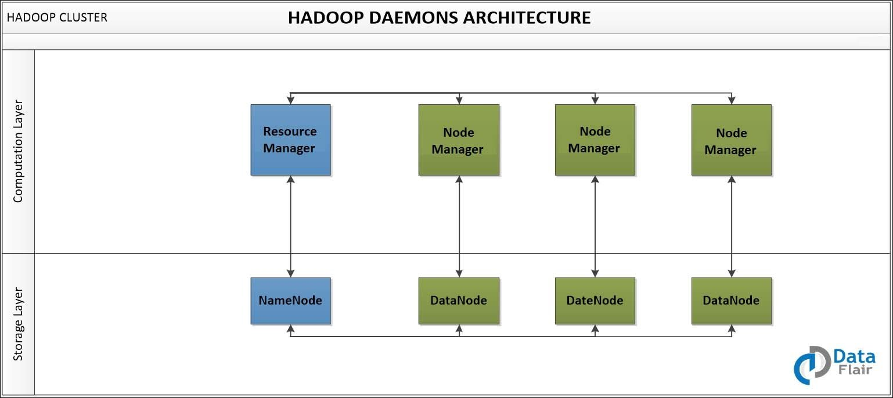
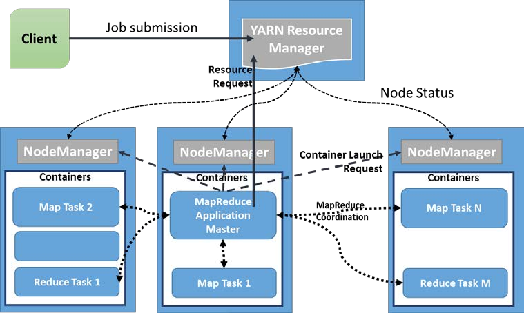
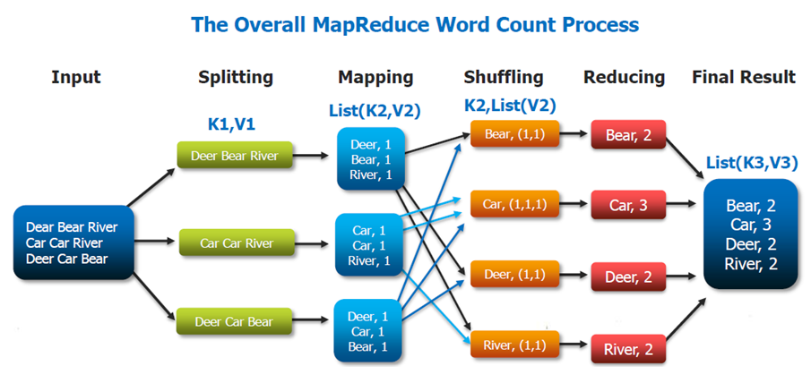

## Big data review

Focus on: Hadoop, Spark, Sqoop, Hive

1. Hadoop and Spark: Compared-style questions

    __Question 1__: What is difference between RDDs and Dataframe?

    |Criteria| RDD |Dataframe|
    |:------:|:---:|:-------:|
    |API|low-level|high-level|
    |Distributed collection of data|No predefined structure, need to do it manually|Organized into table with schema|
    |Type of data|Unstructured Data like streams|Structured and semi-structure data|
    |Data Manipulation|Using function programming -> developer loves it|Provides a domain specific language API; and makes Spark accessible to a wider audience, beyond specialized data engineers. -> developer hates it but analytics people like it|
    |Optimization Engine|No built-in optimization engine|Using catalyst optimizer|
    |Serialization|Java and Scala object, require sending both data and structure|off-heap memory in binary format|
    |Efficiency|Decreased when using serialization|Generate byte code, no need for de-serialization for small operations|

    In general, RDD provide low-level functionality and control. While Dataframe allow custom view and structure. Furthermore, Dataframe offers high-level domain specific operation, save space and execute at high speed.

    __Question 2__: What is Serialization and De-serialization?

    - Serialization: convert object into streamable data, byte stream.
    - Deserialization: restore an object from a serial representation and ensure the invariants of the objects.

    __Question 3__: What is difference between Hadoop MR and Spark?
    
    |Criteria| Hadoop MR |  Spark  |
    |:------:|:---------:|:-------:|
    | Speed  | Slower than Spark due to I/O disk latency |100x times faster|
    | Data Processing| Batch Processing| Batch / realtime/ iterative / interactive/ graph|
    | Category | Data Processing Engine| Data Analytics Engine|
    | Costs| Less, can use commodity hardware | cost more because of large amount of RAM |
    | Scalability| 1000 nodes in single cluster | 1000 nodes in single cluster |
    | Fault Tolerance| Use replication | Use RDD and other data storage models |
    | Real-time | No  | Yes |
    | Cache | No | Yes |

    __Question 3__: What daemons in Hadoop?
    There are 5 daemons
    - __NameNode:__  __Chief Commander House__, Master, store metadata such as number of blocks, location like Rack, it is a storage layer.
    - __DataNode:__ __Group House__ Slave, store actual data in HDFS, block replication, manage file system. __soldiers__
    - __Resource Manager (YARN):__  __Chief Commander__
      - A big guy who know everything and control how much containers will be use to a jobs.
      - Handle all jobs coming
      - Manage and allocate resource for each application
    - __Node Manager:__ __Group Leader__
      - Manage resource of single node
      - Report to __Chief Commander (Resource manager)__ about available resources
    - __Application Master__ created for each application process
      - A process initialized by RM,
      - Keep track of submitted job
      - Decide how much container will be used for a task

    

    

    __Question 4__: Word count example in MapReduce?

    

    __Question 5__:

2. Sqoop vs Flume

### Reference

1. [Github Markdown Cheatsheet](https://github.com/adam-p/markdown-here/wiki/Markdown-Cheatsheet)
2. [RDD vs Dataframe Databricks](https://databricks.com/blog/2016/07/14/a-tale-of-three-apache-spark-apis-rdds-dataframes-and-datasets.html)
3. [MapReduce vs Spark](https://www.educba.com/mapreduce-vs-apache-spark/)
